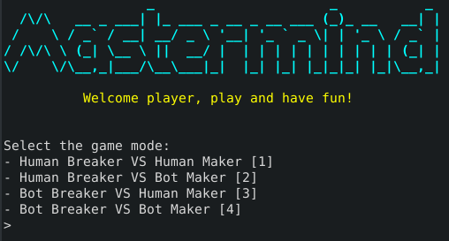

  

--- 

  
    <b>MasterMind</b>, il famoso gioco da tavolo realizzato in <b>Java</b> per il corso di laurea <b>L-31</b> presso <b>Unicam</b>, <i>nell'anno accademico 2018/2019</i>, realizzato dagli studenti Francesco Coppola e Francesco Pio Stelluti per il progetto di <b>Programmazione Avanzata</b> seguendo i canoni di sviluppo proposti
      <b>
<a href="https://www.unicam.it/">• Unicam</a>
<a href="https://www.github.io/azzeccagarbugli/MasterMind">• Documentazione</a>
<a href="https://it.wikipedia.org/wiki/Licenza_MIT">• Licenza</a>
<a href="https://www.youtube.com/watch?v=dQw4w9WgXcQ">• Contribuisci</a>
</b>

# Introduzione

Il seguente parco software è stato realizzato secondo i principi
**S.O.L.I.D**, che rendono quest'utlimo *estremamente* modulabile,
flessibile ed efficente.

Essi descrivono dei canoni fondamentali per andare ad organizzare
l'intera struttura del codice in maniera **elegante** e **formale**:

  - Afferma che ogni classe dovrebbe avere una ed una sola
    responsabilità, interamente incapsulata al suo interno
  - Un'entità software dovrebbe essere aperta alle estensioni, ma chiusa
    alle modifiche
  - Gli oggetti dovrebbero poter essere sostituiti con dei loro
    sottotipi, senza alterare il comportamento del programma che li
    utilizza
  - Sarebbero preferibili più interfacce specifiche, che una singola
    generica
  - Una classe dovrebbe dipendere dalle astrazioni, non da classi
    concrete

# Scelta del progetto

**Mastermind** o *Master Mind* è un gioco da tavolo astratto di
*crittoanalisi* per due giocatori, in cui un giocatore, il
**"decodificatore"**, deve indovinare il codice segreto composto dal suo
avversario, detto **"codificatore"**.

## Interfaccia di gioco

La realizzazione dell'*interfaccia grafica*, con la quale ci si
confronta all'interno del gioco, è stata realizzata all'interno della
`console` stessa e presenta un aspetto di questo genere:

Come è possibile notare sono stati scelti i medesimi colori che venogno
utilizzati all'interno delle regole ufficiali del gioco:

  - Otto colori *(inclusi il bianco e nero)* descrivono quella che è la
    possibile sequenza da indovinare
  - Due colori, il **bianco** e il **nero**, descrivono invece la
    conferma di aver indovinato rispettivamente solo la presenza del
    colore o sia la presenza del colore che l'indice nella sequenza

## Menù di gioco

Attraverso il *menù di gioco* l'utente potrà selezionare la modalità di
gioco con la quale desidera giocare:

1.    - **Human Breaker VS Human Maker**
        
          - La seguente modalità consentirà a due player *umani* di
            effettuare un match. Uno dei due sarà colui che selezionerà
            la sequenza da decodificatore e l'altro invece avrà il ruolo
            di codificatore

2.    - **Human Breaker VS Bot Maker**
        
          - Mediante tale modalità l'utente *umano* cercherà di
            decodificare una sequenza prodotta in maniera del tutto
            casuale da un player *bot*

3.    - **Bot Breaker VS Human Maker**
        
          - Viene effettuato semplicemente il cambio dei ruoli rispetto
            a quello che era la modalità di gioco illustrata in
            precedenza

4.    - **Bot Breaker VS Bot Maker**
        
          - Verranno fatti scontrare semplicemente due *bot*, mediante
            dei meri e puri algoritmi
