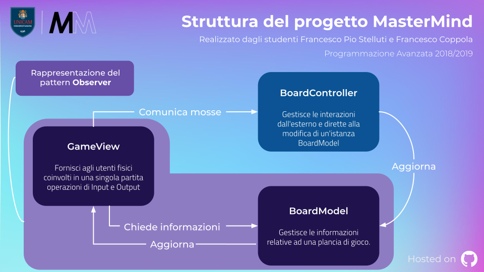

  

--- 

  
    <b>MasterMind</b>, il famoso gioco da tavolo realizzato in <b>Java</b> per il corso di laurea <b>L-31</b> presso <b>Unicam</b>, <i>nell'anno accademico 2018/2019</i>, realizzato dagli studenti Francesco Coppola e Francesco Pio Stelluti per il progetto di <b>Programmazione Avanzata</b> seguendo i canoni di sviluppo proposti
      <b>
<a href="https://www.unicam.it/">• Unicam</a>
<a href="https://www.github.io/azzeccagarbugli/MasterMind">• Documentazione</a>
<a href="https://it.wikipedia.org/wiki/Licenza_MIT">• Licenza</a>
<a href="https://www.youtube.com/watch?v=dQw4w9WgXcQ">• Contribuisci</a>
<a href="https://travis-ci.com/Azzeccagarbugli/MasterMind">• </img></a>
</b>

# Introduzione

Il progetto è stato indirizzato ad all’implementazione tramite
linguaggio **Java** del gioco da tavolo **Mastermind**.
Nell’ideare la struttura del progetto si è puntato alla **massima
modularità possibile**, per quanto non totale, ottenuta tramite
l’applicazione di determinati design pattern.

# Struttura fondamentale del progetto

L’idea alla base della struttura del gioco riguarda le *interazioni* tra
l’utente umano ed un’istanza di una classe che estende `StartView`.
Tramite questa interazione è possibile decidere quali impostazioni e
quali implementazioni dei giocatori, rispettivamente un `CodeBreaker` ed
un `CodeMaker`, impiegare all’interno di singole partite. I giocatori
potranno poi interagire all’interno della partita comunicando con una
istanza di una classe che estende `InteractionView`, dalla quale
ottengono informazioni sulla partita in corso e grazie alla quale hanno
una possibile interazione con l’utente umano, e con una istanza di
`BoardController`, alla quale **comunicano** decisioni di gioco quali la
sequenza da indovinare o le sequenze valide come tentativo per poter
indovinare tale sequenza.

Alla base della sequenza, a rappresentazione dei pioli impiegati nel
gioco originale, sono presenti valori della classe enum `ColorPegs`,
contenente otto colori.

## Estendibilità ed implementazioni fornite di default

Si è deciso di adottare una struttura molto rigida per quanto riguarda
la rappresentazione dei pioli e della plancia di gioco, non offrendo
possibilità di aggiungere ulteriori implementazioni o diversificazioni
di quelle che sono le classi **ColorPegs**, **BoardModel** e
**BoardCoordinator**. Diverso il discorso sul piano delle
implementazioni di giocatori o delle interfacce di comunicazione con
l’utente umano. È infatti possibile aggiungere classi che estendono
`CodeMaker` e `CodeBreaker`, fornendo anche le relative classi *factory*
che estendono rispettivamente `MakerFactory` e `BreakerFactory`, senza
che il codice venga ricompilato. Per fare ciò si è deciso di
implementare una classe astratta `PlayerFactoryRegistry`, estesa nel
progetto in questione da `MakerFactoryRegistry` e
`BreakerFactoryRegistry`, classi che permettono di **collezionare a
runtime** informazioni riguardo le factory puntate a generare istannze
di classi estensione di `CodeMaker` e `CodeBreaker`. Analogamente è
possibile aggiungere classi estensione di `StartView` per fornire
particolari *viste* indirizzate **all’interazione** con l’utente fisico
durante l’impostazione e l’avvio di nuove partite. Ad ogni `StartView`
si richiede di associare anche una classe che estenda `InteractionView`
che sia **coerente** con la particolare estensione di StartView trattata
e di includere il metodo **main** per permettere l’avvio effettivo del
programma.

Di default sono fornite delle implementazioni di quelle che sono le classi
rappresentanti i giocatori e l'interazione con l'utente umano:

  - **ConsoleStartView**: estensione di `StartView`, fornisce
    un'interazione con l'utente fisico per l'impostazione e l'avvio di
    nuove partite tramite console.
  - **ConsoleInteractionView**: estensione di `InteractionView`, è
    strettamente associata con la classe `ConsoleStartView` fornisce
    un'interazione con l'utente fisico in caso siano necessarie per
    *impartire* nuove decisioni durante lo svolgimento di una partita.
  - **InteractiveMaker**: estensione di `CodeMaker`, fornisce
    l'implementazione di un giocatore comandato dall'utente umano
    attraverso l'interazione fornita da una classe estensione di
    `InteractionView`. È possibile ottenere istanze di questa estensione
    tramite la classe `InteractiveMakerFactory`.
  - **InteractiveBreaker**: estensione di `CodeBreaker`, fornisce
    l'implementazione di un giocatore comandato dall'utente umano
    attraverso l'interazione fornita da una classe estensione di
    `InteractionView`. È possibile ottenere istanze di questa estensione
    tramite la classe `InteractiveBreakerFactory`.
  - **RandomBotMaker**: estensione di `CodeMaker`, fornisce
    l'implementazione di un giocatore comandato da un **IA** che agisce
    fornendo sequenze randomiche. È possibile ottenere istanze di questa
    estensione tramite la classe `RandomBotMakerFactory`.
  - **RandomBotBreaker**: estensione di `CodeBreaker`, fornisce
    l'implementazione di un giocatore comandato da un **IA** che agisce
    fornendo sequenze randomiche. È possibile ottenere istanze di questa
    estensione tramite la classe `RandomBotBreakerFactory`.

Per ulteriori informazioni circa le classi elencate si rimanda alle
relative sezioni.

## Informazioni fondamentali circa il primo avvio

Il caricamento a **runtime** delle informazioni relative alle classi
factory grazie alle quali ottenere istanze di classi che estendono
`CodeBreaker` e `CodeMaker` è stato reso possibile grazie alla lettura
di specifici file testuali. In loro assenza il software creerà dei file
standard, comunicando all'utente questa decisione, da modificare
**obbligatoriamente** con le giuste informazioni per avere un corretto
avvio ed una corretta esecuzione del programma.

## Responsabilità delle classi

Si rimanda alle sezioni riguardanti le implementazioni delle singole
classi per ulteriori informazioni.

# Design pattern impiegati

1\. **Model View Controller** Rappresenta la struttura alla base
dell'intero gioco. È stata implementata tramite le classi `StartView`,
`InteractionView`, `BoardModel` e `BoardCoordinator`.

2\. **Observer** Implementato fornendo come classe da osservare
`BoardModel` e come classi che osservano `InteractionView` e
`CurrentGameStats`. Dalla versione 9 di Java l'interfaccia Observer, pensata nell'ottica di questo design pattern,
risulta deprecata. La sua implementazione è quindi da vedere in
un'ottica puramente accademica e finalizzata all'apprendimento del
concetto alla base del pattern.

3\. **Singleton** Presente all'interno delle classi `ConsoleStartView` e
`ConsoleInteractionView`, esso garantisce che siano presenti **singole**
istanze di tali classi all'interno del progetto.

4\. **Factory** Implementato tramite l'interfaccia `PlayerFactory`,
implementata da `BreakerFactory` e `MakerFactory`, **classi astratte**
da estendere tramite classi factory che forniscano istanze di classi
estensione rispettivamente di `CodeBreaker` e `CodeMaker`.

# Testing

Sono stati ideati dei test, scritti sotto ambiente **JUnit 5**, per
poter testare in modo mirato le singole *funzionalità* del progetto. Per
ulteriori informazioni si rimanda alle sezioni riguardanti le implementazioni di tali test.

# Gradle

Nell'ottica di garantire continuità al progetto si è deciso anche di
implementare il tool di building **Gradle**, in versione 5.1.1, per
facilitare il deploy e la distribuzione di tale software all'interno di
altri sistemi.

# Crediti

Lo sviluppo di tale codice è da attribuire interamente agli studenti **Francesco Coppola**
e **Francesco Pio Stelluti**, i quali hanno perso sangue, sudore e diverse diottrie durante la stesura di quest'ultimo.