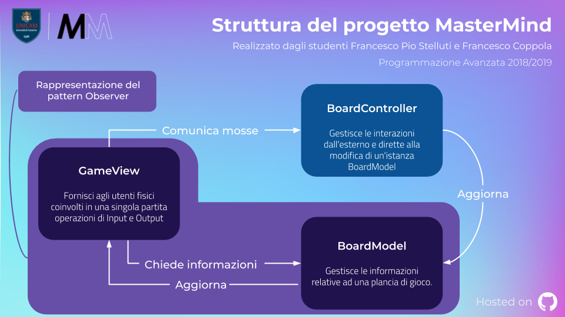

Introduzione
=====================================
Il progetto è stato indirizzato ad all'implementazione tramite linguaggio **Java** 
del gioco da tavolo **Mastermind** [1]_. 

Nell'ideare la struttura del progetto si è puntato
alla **massima modularità possibile**, per quanto non totale, ottenuta tramite l'applicazione
di determinati design pattern.

Architettura fondamentale del progetto
---------------------------------------

L'avvio del programma è delegato ad una classe che estende ``MainManager``, classe astratta contenente il funzionamento effettivo e a più alto livello del programma. 
La particolare estensione di tale classe è delegata a definire quali implementazioni delle classi ``GameViewFactory`` e ``StartView`` si è scelto di impiegare.

Le classi ``GameViewFactory`` e ``StartView`` sono fondamentali in quanto estendibili con classi mirate a fornire delle viste finalizzate all'interazione con gli **utenti fisici**.
Il funzionamento di ``MainManager`` si basa sulla creazione, esecuzione e monitoraggio di istanze personalizzate di ``SingleMatch``, rappresentanti singole partite di gioco.

La corrente implementazione di ``MainManager`` consente la gestione di una singola istanza di ``SingleMatch`` alla volta.
All'interno dell'esecuzione effettiva del metodo di avvio presente in ``SingleMatch`` si ha poi l'interazione di due entità rappresentanti i giocatori, rispettivamente
un ``CodeMaker`` *(colui che definisce la sequenza di ColorPegs da indovinare)* e un ``CodeBreaker`` *(colui che definisce sequenze di ColorPegs valide come tentativi)*,
con l'entità ``BoardController``, attraverso la quale viene aggiornata un'istanza di ``BoardModel`` *(rappresentante una plancia di gioco)*.

Lo svolgimento di un ``SingleMatch`` si conclude quando si è arrivati ad una delle tre condizioni di vittoria, rappresentate dalla sconfitta del ``CodeBreaker`` a causa di una sua resa 
o per l'esaurimento dei tentativi disponibili e dalla sconfitta del ``CodeMaker`` a causa della definizione di una corretta sequenza tentativa da parte del ``CodeBreaker``.
L'interazione con l'utente fisico all'interno del programma è svolta da istanze estensione di ``StartView`` *(mirate alla fase di preparazione dei singoli match)* e da 
istanze estensione di ``GameView`` *(mirate alla gestione delle azioni da eseguire durante i match)*.

Estendibilità ed implementazioni fornite di default
-------------------------------------------------------
L'estendibilità del progetto si sostanzia nella possibilità di definire nuove implementazioni per le seguenti responsabilità:

* **Gestione dell'avvio e del monitoraggio delle singole partite**, rappresentata da ``MainManager``.

* **Gestione dell'interazione con l'utente fisico per l'avvio di nuove partite**, rappresentata da ``StartView``.

* **Gestione dell'interazione con l'utente fisico per la gestione delle azioni all'interno di singole partite**, rappresentata da ``GameView``.

* **Fornire istanze di implementazioni di GameView**, rapprsentata da ``GameViewFactory``.

* **Rappresentazione di un giocatore che decide la sequenza da indovinare**, rappresentata da ``CodeMaker``.

* **Fornire istanze di implementazioni di CodeMaker**, rappresentata da ``MakerFactory``.

* **Rappresentazione di un giocatore che cerca di indovinare la sequenza**, rappresentata da ``CodeBreaker``.

* **Fornire istanze di implementazioni di CodeBreaker**, rappresentata da ``BreakerFactory``.

Esempi di implementazioni già incluse nella release attuale del progetto sono:

* **ConsoleMainManager**, ad estensione di ``MainManager``.

* **ConsoleStartView**, implementazione di ``StartView``.

* **ConsoleGameView**, estensione di ``GameView``.

* **ConsoleGameViewFactory**, implementazione di ``GameViewFactory``.

* **InteractiveMaker, RandomBotMaker**, estensioni di ``CodeMaker``.

* **InteractiveMakerFactory, RandomBotMakerFactory**, implementazioni di ``MakerFactory``.

* **InteractiveBreaker, RandomBotBreaker, DonaldKnuthBreaker**, estensioni di ``CodeBreaker``.

* **InteractiveBreakerFactory, RandomBotBreakerFactory, DonaldKnuthBreakerFactory**, implementazioni di ``BreakerFactory``.

Per ulteriori informazioni circa le classi elencate si rimanda alle relative :doc:`sezioni <source/packages>`. 

Informazioni fondamentali circa il primo avvio
--------------------------------------------------
Il caricamento a **runtime** delle informazioni relative alle classi factory, grazie alle quali ottenere istanze di classi che estendono
``CodeBreaker`` e ``CodeMaker``, è stato reso possibile grazie alla definizione di classi implementazione ``PlayerFactoryRegistry``, classi le cui istanze sono indirizzate
alla lettura a runtime di file di input e al caricamento di istanze di ``BreakerFactory`` e ``MakerFactory``. 

Il formato delle informazioni di tali file di input è molto importante ed in loro assenza ne vengono generati automaticamente altri 
*(all'interno della cartella GameResources)* contenenti le istruzioni necessarie per un corretto avvio del programma. 
Il caricamento a runtime di tali informazioni permette l'aggiunta di nuove funzionalità del programma, nei limiti di estendibilità già trattati, senza avere la
necessità di ricompilare tutte le classi del progetto.

Si rimanda alle :doc:`sezioni <source/packages>` per ulteriori informazioni circa le implementazioni di ``PlayerFactoryRegistry`` fornite.

Responsabilità delle classi
--------------------------------------
Si rimanda alle :doc:`sezioni <source/packages>` riguardanti le implementazioni delle singole classi per ulteriori informazioni.

Design pattern impiegati 
--------------------------------------
1. **Model View Controller** [2]_
Rappresenta la struttura alla base del funzionamento delle singole partite. 
È stata implementata tramite le classi ``GameView``, ``BoardModel`` e ``BoardCoordinator``, classi le cui istanze comunicano all'interno di ``SingleMatch``.
La relazione tra ``GameView`` e ``BoardModel`` non solo rientra nel pattern **Model View Controller** ma anche nel pattern **Observer**.

2. **Observer** [3]_
Dalla versione 9 di Java l'interfaccia Observer, pensata nell'ottica di questo design pattern, risulta deprecata. 
La sua implementazione all'interno di questo progetto è quindi da vedere in un'ottica puramente accademica e finalizzata all'apprendimento del concetto alla base del pattern.
L'implementazione fornita si sostanzia nelle classi ``Observer`` e ``Observable``, rispettivamente interfaccia e classe astratta.
Esempi di relazioni tra classi nel progetto che rientrano nel pattern **Observer** sono quelle tra ``BoardModel`` *(Observable)* e ``MatchState``, ``GameView`` e ``SingleMatch`` *(Observer)*
e tra ``SingleMatch`` *(Observable)* e ``GameView`` *(Observer)*. 
La relazione tra ``GameView`` e ``BoardModel`` non solo rientra nel pattern **Observer** ma anche nel pattern **Model View Controller**.

3. **Singleton** [4]_
Presente all'interno della classe ``ConsoleStartView``, esso garantisce che siano presenti **singole** istanze di tali classe all'interno del progetto.

4. **Factory** [5]_
Implementato tramite le classi ``PlayerFactory``, ``MakerFactory``, ``BreakerFactory`` e le loro implementazioni per poter fornire istanze di giocatori ``CodeMaker`` e ``CodeBreaker``.
Lo stesso pattern è stato inoltre implementato con ``GameViewFactory`` per poter fornire istanze di ``GameView`` all'inizializzazione dei vari ``SingleMatch``.

Testing
--------------------------------------
Sono stati ideati dei test, scritti sotto ambiente **JUnit 5** [6]_, per poter testare in modo mirato le singole *funzionalità* del progetto.

Per ulteriori informazioni si rimanda alle :doc:`sezioni <test/packages>`  riguardanti le implementazioni di tali test.

Gradle
--------------------------------------
Nell'ottica di garantire continuità al progetto si è deciso anche di implementare il tool di building **Gradle** [7]_, in versione **5.4.1**, 
per facilitare il deploy e la distribuzione di tale software all'interno di altri sistemi.

Continuous Integration
------------------------------------

    *La Continuous Integration, proprio come la Continuous Delivery, viene apprezzata soprattutto nello sviluppo agile di software. L'obiettivo di questo moderno metodo è quello di suddividere il lavoro in porzioni più piccole per rendere il processo stesso di sviluppo più efficiente e poter reagire con maggiore flessibilità alle modifiche. La Continuous Integration è stata nominata per la prima volta nella descrizione della metodologia agile Extreme Programming di Kent Beck.*

.. image:: _static/ci.png

Mediante l'implementazione di **Gradle**, illustrata in precedenza, si è riuscito a integrare all'interno della natura del progetto
anche il software **Travis CI** [8]_. 

Quest'ultimo garantisce all'intero progetto la possibilità di sviluppare una **integrazione continua** all'interno di un team di lavoro in primo luogo, *e di consegunza*, una seria di vantaggi non indifferenti, quali:

- **Resa del build auto-testante**
    - Ogni volta che il codice sorgente viene buildato ed impacchettato vengono eseguiti dei test sul sorgente affinché la qualità del codice venga tenuta sotto controllo ed eventuali bug vengano scoperti il prima possibile.
- **Ogni commit lancia una build**
    - Ogni modifica al codice sorgente condiviso potrebbe generare dei bug e quindi compilare e testare subito dà la possibilità di intervenire immediatamente su eventuali falle del sistema.
- **Esecuzione di test in un clone dell'ambiente di produzione**
    - L'ambiente di lavoro può differire in base all'OS adottato e dal hardware stesso della macchina che si adopera, per questo è fondamentale creare un clone del *workspace* che sia il medesimo per tutti i membri del progetto e incontro a tale evenienza viene in aiuto **Docker**.
- **Repository del codice sorgente**
    - Questo elemento è propedeutico a tutti gli altri principi descritti in precedenza, poichè senza avere un repository del codice è impossibile automatizzare il build ed i test.

Aver inserito anche una *feature* come quella del **CI** rende sicuramente l'intero parco software **robusto**, **elegante** e **flessibile**.

.. [1] *Mastermind o Master Mind è un gioco da tavolo astratto di crittoanalisi per due giocatori, in cui un giocatore, il "decodificatore", deve indovinare il codice segreto composto dal suo avversario, detto "codificatore".*
.. [2] *Model-view-controller (MVC, talvolta tradotto in italiano con la dicitura modello-vista-controllo), in informatica, è un pattern architetturale molto diffuso nello sviluppo di sistemi software, in particolare nell'ambito della programmazione orientata agli oggetti, in grado di separare la logica di presentazione dei dati dalla logica di business.*
.. [3] *L'Observer pattern è un design pattern che sostanzialemente si basa su uno o più oggetti, chiamati osservatori o observer, che vengono registrati per gestire un evento che potrebbe essere generato dall'oggetto "osservato", che può essere chiamato soggetto.*
.. [4] *Il singleton è un design pattern creazionale che ha lo scopo di garantire che di una determinata classe venga creata una e una sola istanza, e di fornire un punto di accesso globale a tale istanza.*
.. [5] *Nella programmazione ad oggetti, il Factory Method è uno dei design pattern fondamentali per l'implementazione del concetto di factory. Come altri pattern creazionali, esso indirizza il problema della creazione di oggetti senza specificarne l'esatta classe. Questo pattern raggiunge il suo scopo fornendo un'interfaccia per creare un oggetto, ma lascia che le sottoclassi decidano quale oggetto istanziare.*
.. [6] *In informatica JUnit è un framework di unit testing per il linguaggio di programmazione Java. L'esperienza avuta con JUnit è stata importante nella crescita dell'idea di sviluppo guidato da test (in inglese Test Driven Development), ed è uno di una famiglia di framework di unit testing noti collettivamente come xUnit.*
.. [7] *Gradle è un sistema open source per l'automazione dello sviluppo fondato sulle idee di Apache Ant e Apache Maven, che introduce un domain-specific language (DSL) basato su Groovy, al posto della modalità XML usata da Apache Maven per dichiarare la configurazione del progetto. Gli script Gradle possono essere eseguiti direttamente, in contrasto con le definizioni dei progetti Apache Maven (pom.xml).*
.. [8] *Travis CI è un servizio di integrazione continua utilizzato per costruire e testare progetti software ospitati su GitHub*