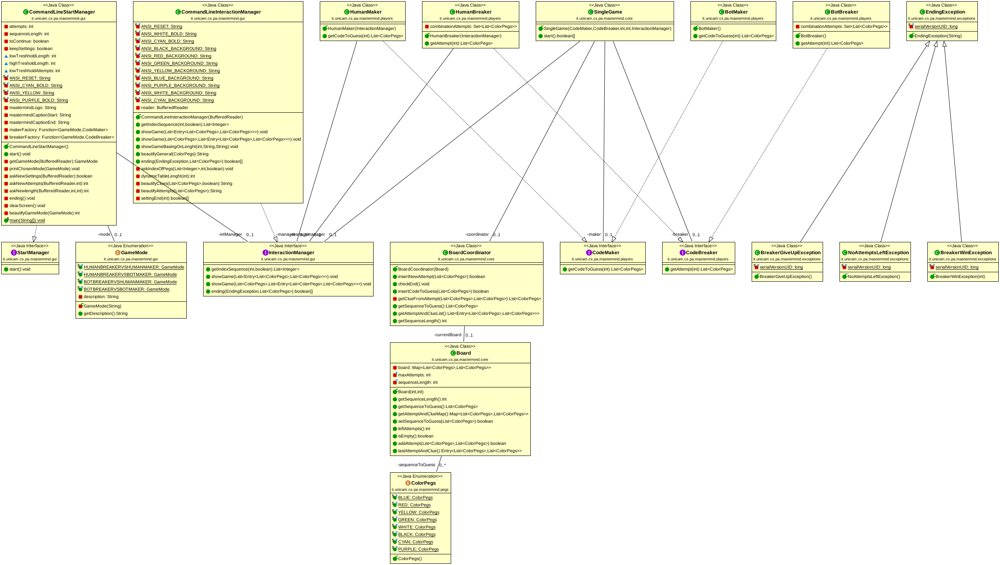

MasterMind
==========

Di seguito sarà possibile accedere a tutto ciò che concerne il **codice sorgente**
del software realizzato.

Esso viene suddiviso in cinque package fondamentali, in cui al loro interno sarà possibile trovare
le classi e i metodi relativi al funzionamento del progetto stesso. 

Per avere una maggiore chiarezza sulla struttura della piattaforma sarà possibile
anche osservare il possibile diagramma UML, il quale rende la famiglia di classi e metodi
più comprensibili:

.. toctree::
   :maxdepth: 2

   it/unicam/cs/pa/mastermind/core/package-index
   it/unicam/cs/pa/mastermind/exceptions/package-index
   it/unicam/cs/pa/mastermind/gui/package-index
   it/unicam/cs/pa/mastermind/pegs/package-index
   it/unicam/cs/pa/mastermind/players/package-index

